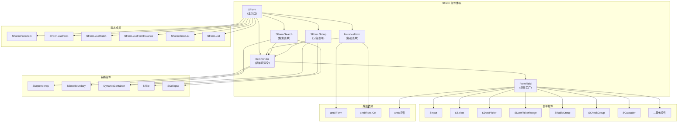
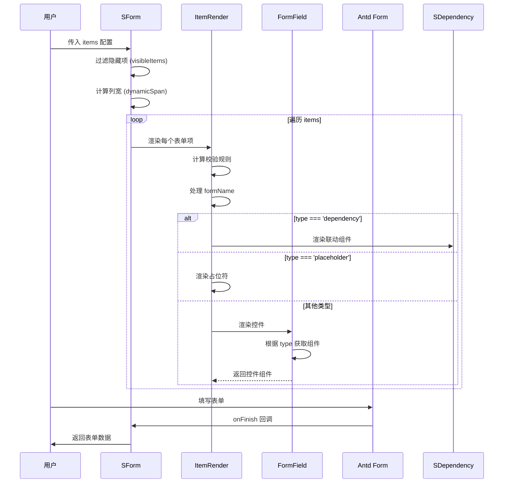
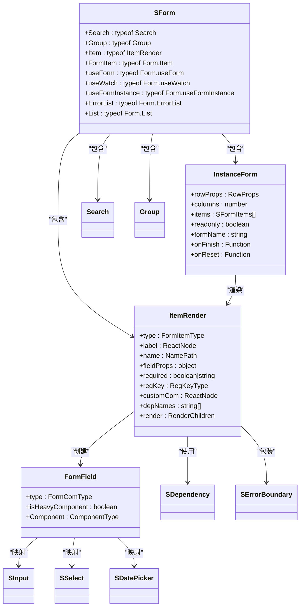
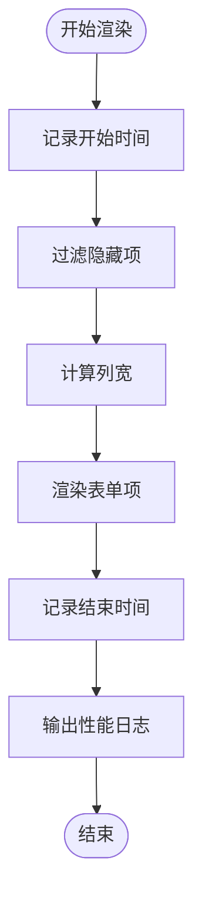
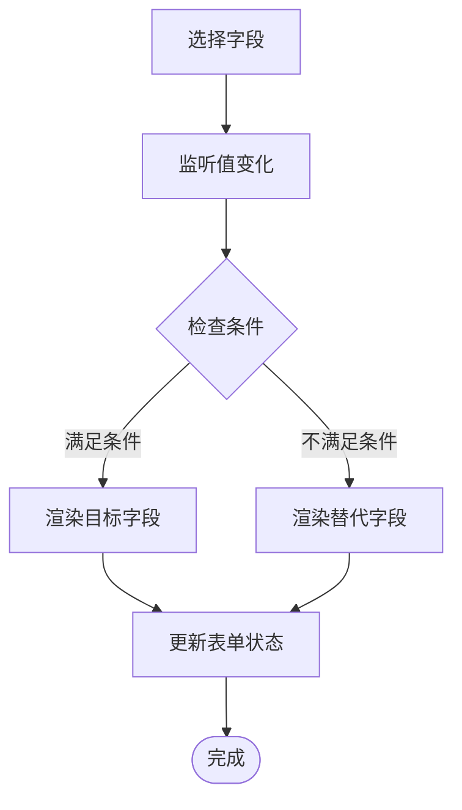
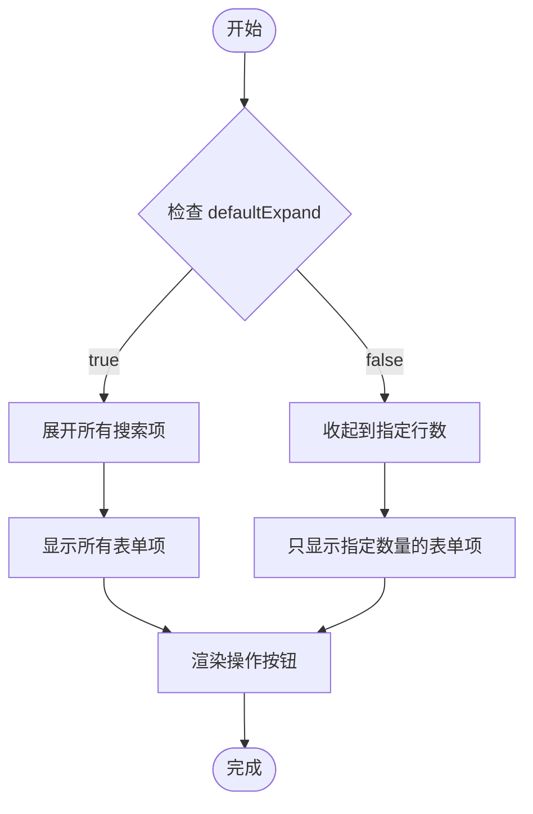
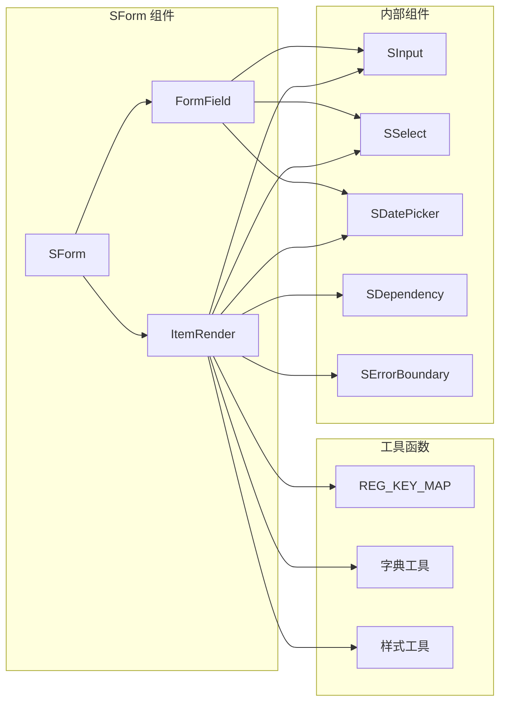

# 表单组件技术文档

<cite>
**本文档引用的文件**
- [src/components/form/index.tsx](file://src/components/form/index.tsx)
- [src/components/form/types.ts](file://src/components/form/types.ts)
- [src/components/form/instance.tsx](file://src/components/form/instance.tsx)
- [src/components/form/constants.tsx](file://src/components/form/constants.tsx)
- [src/components/form/components/item-render/index.tsx](file://src/components/form/components/item-render/index.tsx)
- [src/components/form/components/item-render/constant.ts](file://src/components/form/components/item-render/constant.ts)
- [src/components/form/components/form-field/index.tsx](file://src/components/form/components/form-field/index.tsx)
- [src/components/form/components/search/index.tsx](file://src/components/form/components/search/index.tsx)
- [src/components/form/components/group/index.tsx](file://src/components/form/components/group/index.tsx)
- [src/components/form/form-documentation.md](file://src/components/form/form-documentation.md)
- [src/components/form/demos/full-example.tsx](file://src/components/form/demos/full-example.tsx)
</cite>

## 更新摘要

**变更内容**

- 新增 22 种表单控件类型支持，包括 input、inputNumber、password、textarea、select、slider、radio、radioGroup、switch、treeSelect、upload、datePicker、SDatePicker、datePickerRange、SDatePickerRange、timePicker、timePickerRange、checkbox、checkGroup、cascader、SCascader、table、dependency 等
- 完善类型系统，实现每个控件类型的自动属性类型推断
- 增强表单控件映射表，提供更完整的控件支持
- 优化组件查找性能，支持重型组件的懒加载机制
- 新增完整的配置化表单系统文档，包含详细的功能说明和使用示例

## 目录

1. [简介](#简介)
2. [项目结构](#项目结构)
3. [核心组件](#核心组件)
4. [架构概览](#架构概览)
5. [详细组件分析](#详细组件分析)
6. [配置化表单系统](#配置化表单系统)
7. [表单控件类型详解](#表单控件类型详解)
8. [联动与依赖机制](#联动与依赖机制)
9. [分组表单功能](#分组表单功能)
10. [搜索表单功能](#搜索表单功能)
11. [依赖分析](#依赖分析)
12. [性能考虑](#性能考虑)
13. [故障排除指南](#故障排除指南)
14. [结论](#结论)
15. [附录](#附录)

## 简介

SForm 是基于 Ant Design Form 组件的增强封装，提供了配置化表单生成、分组表单、搜索表单等多种模式。该组件库支持 22+ 种表单控件类型、字段联动、校验规则预置等功能，大幅简化表单开发工作。

### 主要特性

- **配置化生成**：通过 items 配置数组自动生成表单项，减少重复代码
- **多列布局**：支持 columns 指定列数，自动计算栅格
- **字段联动**：通过 dependency 类型实现字段间联动
- **预置校验**：内置常用正则校验规则（邮箱、手机号等）
- **只读模式**：一键切换表单只读/编辑模式
- **嵌套数据**：支持 formName 生成嵌套数据结构
- **性能优化**：使用 memo、useMemo、useCallback 优化渲染
- **类型安全**：完整的 TypeScript 类型系统，支持自动属性推断

## 项目结构

SForm 组件库采用模块化设计，主要包含以下核心文件：



**图表来源**

- [src/components/form/index.tsx:1-34](file://src/components/form/index.tsx#L1-L34)
- [src/components/form/instance.tsx:1-133](file://src/components/form/instance.tsx#L1-L133)
- [src/components/form/constants.tsx:1-73](file://src/components/form/constants.tsx#L1-L73)

**章节来源**

- [src/components/form/index.tsx:1-34](file://src/components/form/index.tsx#L1-L34)
- [src/components/form/types.ts:1-318](file://src/components/form/types.ts#L1-L318)
- [src/components/form/instance.tsx:1-133](file://src/components/form/instance.tsx#L1-L133)

## 核心组件

### SForm 主组件

SForm 作为主入口组件，提供了完整的表单功能集成。它通过组合模式将多个子组件（Search、Group、Item）整合在一起。

### InstanceForm 基础表单

InstanceForm 是 SForm 的核心实现，负责处理基本的表单渲染逻辑。它支持动态列数计算、只读模式切换、嵌套数据结构等功能。

### ItemRender 表单项渲染器

ItemRender 作为表单项的代理组件，统一处理校验规则、依赖关系、自定义渲染等逻辑。它支持多种渲染模式：

- 普通表单项渲染
- 占位符渲染
- 字段联动渲染
- 自定义组件渲染

### FormField 控件工厂

FormField 实现了工厂模式，根据 type 参数动态创建对应的表单控件。它支持重型组件的懒加载和性能优化。

**章节来源**

- [src/components/form/index.tsx:7-34](file://src/components/form/index.tsx#L7-L34)
- [src/components/form/instance.tsx:36-133](file://src/components/form/instance.tsx#L36-L133)
- [src/components/form/components/item-render/index.tsx:16-124](file://src/components/form/components/item-render/index.tsx#L16-L124)
- [src/components/form/components/form-field/index.tsx:21-52](file://src/components/form/components/form-field/index.tsx#L21-L52)

## 架构概览

SForm 采用了多种设计模式来实现高度的可扩展性和可维护性：

### 设计模式

1. **组合模式 (Composite Pattern)**：SForm 作为容器组件，可组合 Search、Group、Item 等子组件
2. **工厂模式 (Factory Pattern)**：FormField 根据 type 动态创建对应的表单控件
3. **策略模式 (Strategy Pattern)**：不同的表单类型使用不同的渲染策略
4. **代理模式 (Proxy Pattern)**：ItemRender 作为表单项的代理，统一处理校验、依赖等逻辑

### 数据流架构



**图表来源**

- [src/components/form/components/item-render/index.tsx:16-124](file://src/components/form/components/item-render/index.tsx#L16-L124)

### 组件关系图



**图表来源**

- [src/components/form/index.tsx:9-31](file://src/components/form/index.tsx#L9-L31)
- [src/components/form/instance.tsx:36-48](file://src/components/form/instance.tsx#L36-L48)
- [src/components/form/components/item-render/index.tsx:16-32](file://src/components/form/components/item-render/index.tsx#L16-L32)
- [src/components/form/components/form-field/index.tsx:21-31](file://src/components/form/components/form-field/index.tsx#L21-L31)

## 详细组件分析

### 类型系统设计

SForm 采用了完整的 TypeScript 类型系统，确保开发时的类型安全和良好的开发体验。

#### 表单控件映射

新增 22 种表单控件类型支持，提供完整的类型推断

```mermaid
erDiagram
FORM_FIELD_MAP_TYPE {
input SInput
inputNumber InputNumber
password Input.Password
textarea Input.TextArea
select SSelect
slider Slider
radio Radio
radioGroup SRadioGroup
switch Switch
treeSelect TreeSelect
upload Upload
datePicker DatePicker
SDatePicker SDatePicker
datePickerRange DatePicker.RangePicker
SDatePickerRange SDatePickerRange
timePicker TimePicker
timePickerRange TimePicker.RangePicker
checkbox Checkbox
checkGroup SCheckGroup
cascader Cascader
SCascader SCascader
table Table
dependency SDependency
}
```

**图表来源**

- [src/components/form/types.ts:50-97](file://src/components/form/types.ts#L50-L97)

#### 表单配置类型

| 属性     | 类型                    | 默认值 | 必填 | 描述               |
| -------- | ----------------------- | ------ | ---- | ------------------ |
| items    | `SFormItems[]`          | -      | 否   | 表单配置项数组     |
| columns  | `number`                | 1      | 否   | 表单列数           |
| rowProps | `RowProps`              | -      | 否   | Row 组件属性       |
| readonly | `boolean`               | false  | 否   | 是否只读模式       |
| formName | `string`                | -      | 否   | 嵌套数据结构的前缀 |
| onFinish | `(values: any) => void` | -      | 否   | 表单提交回调       |
| onReset  | `(e: any) => void`      | -      | 否   | 表单重置回调       |

**章节来源**

- [src/components/form/types.ts:66-115](file://src/components/form/types.ts#L66-L115)

### 性能优化策略

SForm 实现了多层次的性能优化，确保在大型表单场景下的良好表现。

#### 组件级优化

1. **React.memo 包裹**：所有子组件都使用 memo 包裹，避免不必要的重新渲染
2. **useMemo 缓存**：缓存计算结果，如表单配置、间距、样式等
3. **useCallback 优化**：优化事件处理器，减少函数引用变化

#### 组件查找优化

1. **Map 数据结构**：使用 Map 优化组件查找性能，从 O(n) 降至 O(1)
2. **重型组件懒加载**：对 cascader、table、upload、treeSelect 等组件使用懒加载

#### 性能监控



**图表来源**

- [src/components/form/instance.tsx:17-34](file://src/components/form/instance.tsx#L17-L34)
- [src/components/form/instance.tsx:98-101](file://src/components/form/instance.tsx#L98-L101)

**章节来源**

- [src/components/form/instance.tsx:17-34](file://src/components/form/instance.tsx#L17-L34)
- [src/components/form/constants.tsx:55-73](file://src/components/form/constants.tsx#L55-L73)
- [src/components/form/components/form-field/index.tsx:13-49](file://src/components/form/components/form-field/index.tsx#L13-L49)

### 校验规则处理

SForm 提供了灵活的校验规则处理机制：

1. **预置校验规则**：内置常用正则表达式（邮箱、手机号等）
2. **必填规则**：支持字符串和布尔值两种必填配置方式
3. **自定义规则**：允许传入 Ant Design 原生规则

**章节来源**

- [src/components/form/components/item-render/index.tsx:38-45](file://src/components/form/components/item-render/index.tsx#L38-L45)

### 字段联动实现

通过 dependency 类型实现字段间的动态联动：



**图表来源**

- [src/components/form/components/item-render/index.tsx:88-96](file://src/components/form/components/item-render/index.tsx#L88-L96)

**章节来源**

- [src/components/form/components/item-render/index.tsx:88-96](file://src/components/form/components/item-render/index.tsx#L88-L96)

## 配置化表单系统

### 核心概念

SForm 的配置化表单系统通过声明式的方式定义表单结构，开发者只需提供配置数组即可生成完整的表单界面。

### 配置项详解

#### 基础配置项

| 配置项     | 类型                | 默认值  | 必填 | 描述                                  |
| ---------- | ------------------- | ------- | ---- | ------------------------------------- |
| type       | `FormItemType`      | 'input' | 否   | 组件类型                              |
| label      | `ReactNode`         | -       | 否   | 标签文本                              |
| name       | `NamePath`          | -       | 否   | 字段名                                |
| fieldProps | `object`            | -       | 否   | 传递给控件的属性                      |
| required   | `boolean \| string` | -       | 否   | 是否必填，string 时为错误提示         |
| regKey     | `RegKeyType`        | -       | 否   | 预置校验规则 key                      |
| hidden     | `boolean`           | false   | 否   | 是否隐藏                              |
| disabled   | `boolean`           | false   | 否   | 是否禁用                              |
| readonly   | `boolean`           | false   | 否   | 是否只读                              |
| colProps   | `ColProps`          | -       | 否   | Col 组件属性                          |
| depNames   | `string[]`          | -       | 否   | 依赖字段 (type='dependency' 时生效)   |
| render     | `RenderChildren`    | -       | 否   | 自定义渲染 (type='dependency' 时生效) |
| customCom  | `ReactNode`         | -       | 否   | 自定义组件                            |
| formName   | `string`            | -       | 否   | 嵌套数据结构前缀                      |

### 表单模式

#### 基础表单 (SForm)

最常用的表单模式，支持基本的表单项配置和布局。

#### 搜索表单 (SForm.Search)

专为搜索场景设计的表单，支持展开收起、操作按钮等搜索功能。

#### 分组表单 (SForm.Group)

将表单分为多个带标题的分组区块，适用于复杂的表单界面。

**章节来源**

- [src/components/form/types.ts:132-186](file://src/components/form/types.ts#L132-L186)
- [src/components/form/types.ts:206-231](file://src/components/form/types.ts#L206-L231)
- [src/components/form/types.ts:238-280](file://src/components/form/types.ts#L238-L280)

## 表单控件类型详解

### 支持的控件类型

SForm 支持 22 种不同的表单控件类型，每种类型都有其特定的用途和配置选项。

#### 文本类控件

| 类型        | 对应组件       | 说明       | 特殊属性                          |
| ----------- | -------------- | ---------- | --------------------------------- |
| input       | SInput         | 输入框     | placeholder, maxLength, showCount |
| inputNumber | InputNumber    | 数字输入框 | min, max, precision, step         |
| password    | Input.Password | 密码输入框 | -                                 |
| textarea    | Input.TextArea | 文本域     | placeholder, autoSize, maxLength  |

#### 选择类控件

| 类型       | 对应组件    | 说明         | 特殊属性                       |
| ---------- | ----------- | ------------ | ------------------------------ |
| select     | SSelect     | 下拉选择     | dict, mode, showSearch         |
| radioGroup | SRadioGroup | 单选组       | dict, optionType               |
| checkGroup | SCheckGroup | 多选组       | dict, optionType               |
| treeSelect | TreeSelect  | 树选择       | treeData, treeDefaultExpandAll |
| cascader   | Cascader    | 级联选择     | options, showSearch            |
| SCascader  | SCascader   | 增强级联选择 | dict, level                    |

#### 日期时间类控件

| 类型             | 对应组件               | 说明             | 特殊属性             |
| ---------------- | ---------------------- | ---------------- | -------------------- |
| datePicker       | DatePicker             | 日期选择         | format, disabledDate |
| SDatePicker      | SDatePicker            | 增强日期选择     | onChange 返回字符串  |
| datePickerRange  | DatePicker.RangePicker | 日期范围选择     | format, separator    |
| SDatePickerRange | SDatePickerRange       | 增强日期范围选择 | rangeKeys 拆分       |
| timePicker       | TimePicker             | 时间选择         | format, use12Hours   |
| timePickerRange  | TimePicker.RangePicker | 时间范围选择     | format, use12Hours   |

#### 其他控件

| 类型       | 对应组件    | 说明         | 特殊属性                           |
| ---------- | ----------- | ------------ | ---------------------------------- |
| slider     | Slider      | 滑动输入条   | min, max, marks, step              |
| switch     | Switch      | 开关         | checkedChildren, unCheckedChildren |
| upload     | Upload      | 文件上传     | action, accept, maxCount           |
| checkbox   | Checkbox    | 复选框       | -                                  |
| table      | Table       | 嵌套表格     | columns, dataSource                |
| dependency | SDependency | 字段依赖联动 | depNames, render                   |

### 控件属性类型推断

SForm 实现了完整的 TypeScript 类型系统，每个控件类型的属性都会根据 type 自动推断：

```typescript
// 根据 type 自动推断 fieldProps 类型
const items: SFormItems[] = [
  {
    type: 'select', // type 为 'select'
    fieldProps: {
      dict: { admin: '管理员', user: '普通用户' }, // 自动推断为 SSelectProps
    },
  },
  {
    type: 'inputNumber', // type 为 'inputNumber'
    fieldProps: {
      min: 0,
      max: 100,
      precision: 2, // 自动推断为 InputNumberProps
    },
  },
];
```

**章节来源**

- [src/components/form/types.ts:50-97](file://src/components/form/types.ts#L50-L97)
- [src/components/form/constants.tsx:28-53](file://src/components/form/constants.tsx#L28-L53)

## 联动与依赖机制

### 字段联动原理

SForm 的字段联动通过 `dependency` 类型实现，允许根据其他字段的值动态显示或隐藏表单项。

### 实现机制

1. **依赖监听**：通过 `depNames` 指定依赖的字段名称
2. **值变化监听**：使用 `useWatch` 监听依赖字段的值变化
3. **条件渲染**：根据依赖字段的值决定渲染哪个表单项
4. **动态更新**：当依赖字段值变化时，自动更新联动的表单项

### 使用示例

```typescript
const items: SFormItems[] = [
  {
    type: 'select',
    label: '用户类型',
    name: 'userType',
    fieldProps: {
      dict: { individual: '个人', company: '企业' },
    },
  },
  {
    type: 'dependency',
    depNames: ['userType'],
    render: (values) => {
      if (values.userType === 'individual') {
        return (
          <Form.Item name="idCard" label="身份证号" required>
            <Input placeholder="请输入身份证号" />
          </Form.Item>
        );
      } else {
        return (
          <Form.Item name="businessLicense" label="营业执照" required>
            <Input placeholder="请输入营业执照号码" />
          </Form.Item>
        );
      }
    },
  },
];
```

### 性能优化

1. **条件渲染**：只有当依赖字段值满足条件时才渲染目标表单项
2. **懒加载**：联动的表单项在需要时才进行渲染
3. **值缓存**：使用 `useMemo` 缓存计算结果，避免重复计算

**章节来源**

- [src/components/form/components/item-render/index.tsx:88-96](file://src/components/form/components/item-render/index.tsx#L88-L96)
- [src/components/form/components/item-render/constant.ts:120-129](file://src/components/form/components/item-render/constant.ts#L120-L129)

## 分组表单功能

### 分组表单概述

分组表单将复杂的表单界面划分为多个逻辑清晰的分组，每个分组都有自己的标题、布局和配置。

### 配置结构

```typescript
interface GroupItemsType {
  /** 自定义分组容器组件 */
  container?: React.ComponentType<any>;
  /** 该分组的列数 */
  columns?: number;
  /** 分组标题 */
  title?: ReactNode;
  /** 该分组的表单项 */
  items?: Array<SFormItems<FormItemType>>;
  rowProps?: RowProps;
  /** 嵌套表单的字段前缀 */
  formName?: string;
}
```

### 使用示例

```typescript
const groupItems: GroupItemsType[] = [
  {
    title: '基础信息',
    columns: 2,
    items: [
      { type: 'input', label: '姓名', name: 'name', required: true },
      { type: 'input', label: '电话', name: 'phone' },
      {
        type: 'select',
        label: '性别',
        name: 'gender',
        fieldProps: { dict: { male: '男', female: '女' } },
      },
    ],
  },
  {
    title: '详细信息',
    items: [
      {
        type: 'textarea',
        label: '地址',
        name: 'address',
        colProps: { span: 24 },
      },
      { type: 'SDatePicker', label: '出生日期', name: 'birthday' },
    ],
  },
];

return <SForm.Group groupItems={groupItems} />;
```

### 布局控制

1. **列数控制**：每个分组可以独立设置列数
2. **标题定制**：支持字符串或自定义组件作为标题
3. **容器定制**：可以为分组设置自定义容器组件
4. **间距控制**：支持 rowProps 和 colProps 进行间距控制

**章节来源**

- [src/components/form/types.ts:238-250](file://src/components/form/types.ts#L238-L250)
- [src/components/form/components/group/index.tsx:24-135](file://src/components/form/components/group/index.tsx#L24-L135)

## 搜索表单功能

### 搜索表单特点

搜索表单专门针对搜索场景进行了优化，提供了展开收起、操作按钮、卡片容器等特性。

### 核心配置

| 配置项        | 类型                        | 默认值 | 描述                 |
| ------------- | --------------------------- | ------ | -------------------- |
| showExpand    | `boolean`                   | true   | 是否显示展开收起按钮 |
| defaultExpand | `boolean`                   | false  | 默认是否展开         |
| onExpand      | `(expand: boolean) => void` | -      | 展开收起回调         |
| expandLine    | `number`                    | -      | 收起时显示的行数     |
| actionNode    | `ReactNode`                 | -      | 自定义操作节点       |
| isCard        | `boolean`                   | true   | 是否包裹在卡片中     |
| container     | `React.ComponentType`       | -      | 自定义容器组件       |

### 展开收起机制



**图表来源**

- [src/components/form/components/search/index.tsx:35-47](file://src/components/form/components/search/index.tsx#L35-L47)

### 操作按钮

搜索表单默认提供查询和重置两个操作按钮，支持自定义操作节点：

```typescript
const actionNode = (
  <Flex gap={12}>
    <Button icon={<SearchOutlined />} type="primary" htmlType="submit">
      查询
    </Button>
    <Button icon={<ReloadOutlined />} htmlType="reset">
      重置
    </Button>
    <Button onClick={handleCustomAction}>自定义操作</Button>
  </Flex>
);
```

**章节来源**

- [src/components/form/types.ts:299-317](file://src/components/form/types.ts#L299-L317)
- [src/components/form/components/search/index.tsx:17-147](file://src/components/form/components/search/index.tsx#L17-L147)

## 依赖分析

### 外部依赖

SForm 依赖于多个成熟的第三方库：

| 依赖类型 | 依赖项     | 版本     | 用途               |
| -------- | ---------- | -------- | ------------------ |
| 核心框架 | react      | >=18.0.0 | React 核心库       |
| UI 框架  | antd       | >=5.20.6 | Ant Design 组件库  |
| 工具库   | lodash     | ^4.17.21 | 工具函数库         |
| Hooks 库 | ahooks     | ^3.7.4   | React Hooks 工具集 |
| 样式库   | antd-style | ^3.6.2   | 样式解决方案       |

### 内部依赖

SForm 与其他组件库内部组件的依赖关系：



**图表来源**

- [src/components/form/constants.tsx:28-53](file://src/components/form/constants.tsx#L28-L53)

**章节来源**

- [src/components/form/constants.tsx:28-53](file://src/components/form/constants.tsx#L28-L53)

## 性能考虑

### 渲染性能优化

1. **组件记忆化**：所有核心组件都使用 React.memo 包裹
2. **计算结果缓存**：使用 useMemo 缓存昂贵的计算结果
3. **函数引用稳定化**：使用 useCallback 稳定函数引用

### 包大小优化

1. **按需加载**：重型组件支持动态导入
2. **Tree Shaking**：优化打包体积，移除未使用的代码
3. **代码分割**：将大型组件拆分为独立模块

### 用户体验优化

1. **加载状态**：重型组件使用 Suspense 提供加载反馈
2. **错误边界**：使用 SErrorBoundary 防止单个组件错误影响整体
3. **响应式布局**：支持不同屏幕尺寸的自适应布局

## 故障排除指南

### 常见问题及解决方案

#### 表单校验不生效

1. **检查字段名称**：确保每个表单项都有唯一的 name 属性
2. **验证规则格式**：确认 rules 数组格式正确
3. **必填规则设置**：检查 required 属性配置

#### 字段联动失效

1. **depNames 配置**：确认依赖字段名称正确
2. **render 函数**：确保 render 函数返回有效的 React 节点
3. **值访问**：通过 values 参数正确访问依赖字段值

#### 性能问题

1. **组件记忆化**：检查是否正确使用 memo 包裹组件
2. **重渲染分析**：使用 React DevTools 分析重渲染原因
3. **大数据优化**：对于大量数据，考虑虚拟滚动方案

#### 样式问题

1. **CSS 优先级**：检查自定义样式的优先级设置
2. **主题变量**：确认 Ant Design 主题变量配置正确
3. **响应式断点**：验证不同屏幕尺寸下的布局表现

**章节来源**

- [src/components/form/components/item-render/index.tsx:16-124](file://src/components/form/components/item-render/index.tsx#L16-L124)

## 结论

SForm 组件库通过精心设计的架构和全面的优化策略，为 React 应用提供了强大而灵活的表单解决方案。其核心优势包括：

1. **高度可配置**：通过 items 配置实现零样板代码的表单生成
2. **性能卓越**：多层优化确保在大型表单场景下的流畅体验
3. **扩展性强**：完善的类型系统和插件机制支持功能扩展
4. **开发友好**：丰富的示例和详细的文档降低学习成本
5. **类型安全**：完整的 TypeScript 类型系统，支持自动属性推断

该组件库特别适合需要快速构建复杂表单界面的企业级应用，能够显著提升开发效率和用户体验。

## 附录

### 使用示例

#### 基础表单使用

```typescript
const items: SFormItems[] = [
  {
    type: 'input',
    label: '用户名',
    name: 'username',
    required: '请输入用户名',
  },
  {
    type: 'select',
    label: '角色',
    name: 'role',
    fieldProps: { dict: { admin: '管理员', user: '普通用户' } },
  },
];

return (
  <SForm items={items} columns={2} onFinish={(values) => console.log(values)} />
);
```

#### 搜索表单使用

```typescript
export default () => {
  const items: SFormItems[] = [
    { type: 'input', label: '关键词', name: 'keyword' },
    { type: 'select', label: '状态', name: 'status' },
    { type: 'SDatePickerRange', label: '日期范围', name: 'dateRange' },
  ];

  return (
    <SForm.Search
      items={items}
      columns={4}
      onFinish={(values) => console.log('搜索:', values)}
    />
  );
};
```

#### 分组表单使用

```typescript
const groupItems: GroupItemsType[] = [
  {
    title: '基础信息',
    columns: 2,
    items: [
      { type: 'input', label: '姓名', name: 'name', required: true },
      { type: 'input', label: '电话', name: 'phone' },
    ],
  },
];

return <SForm.Group groupItems={groupItems} />;
```

**章节来源**

- [src/components/form/demos/full-example.tsx:29-195](file://src/components/form/demos/full-example.tsx#L29-L195)
- [src/components/form/components/search/index.tsx:17-147](file://src/components/form/components/search/index.tsx#L17-L147)
- [src/components/form/components/group/index.tsx:24-135](file://src/components/form/components/group/index.tsx#L24-L135)
