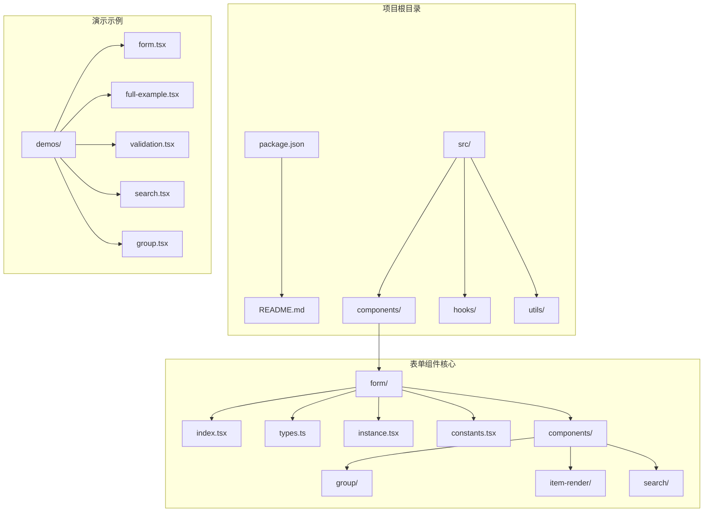
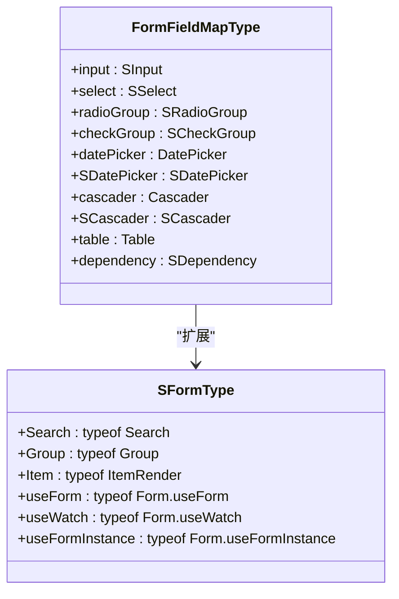
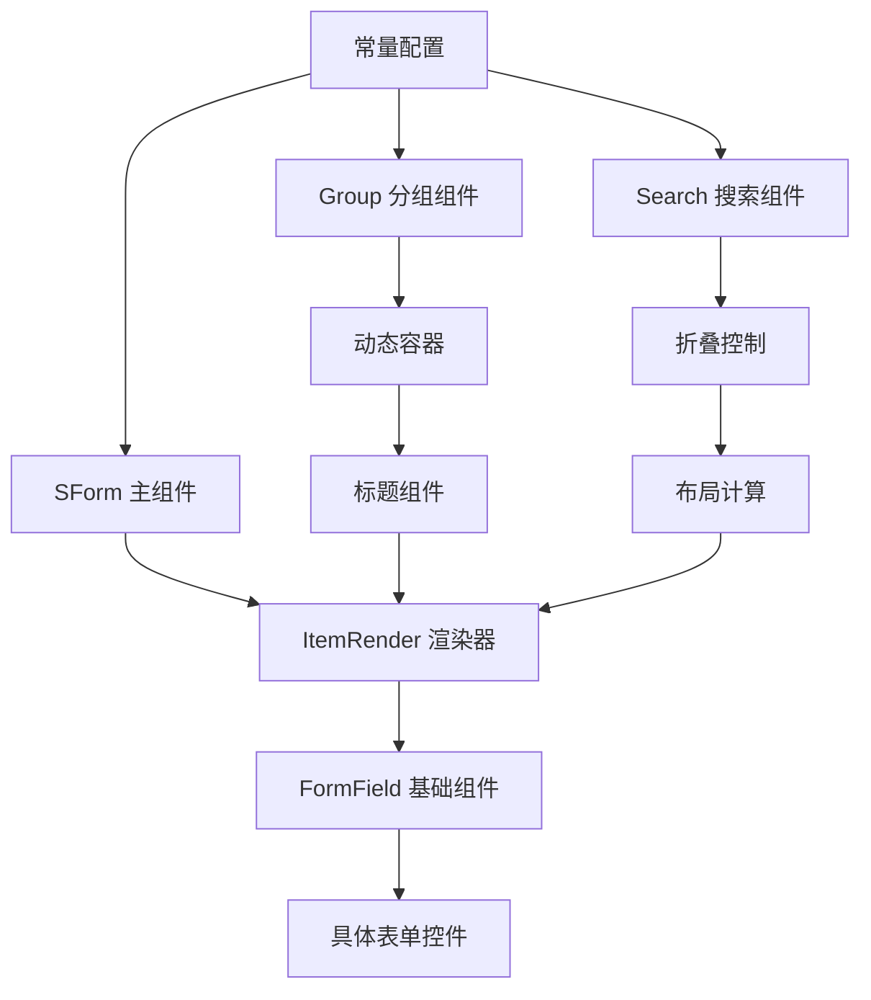
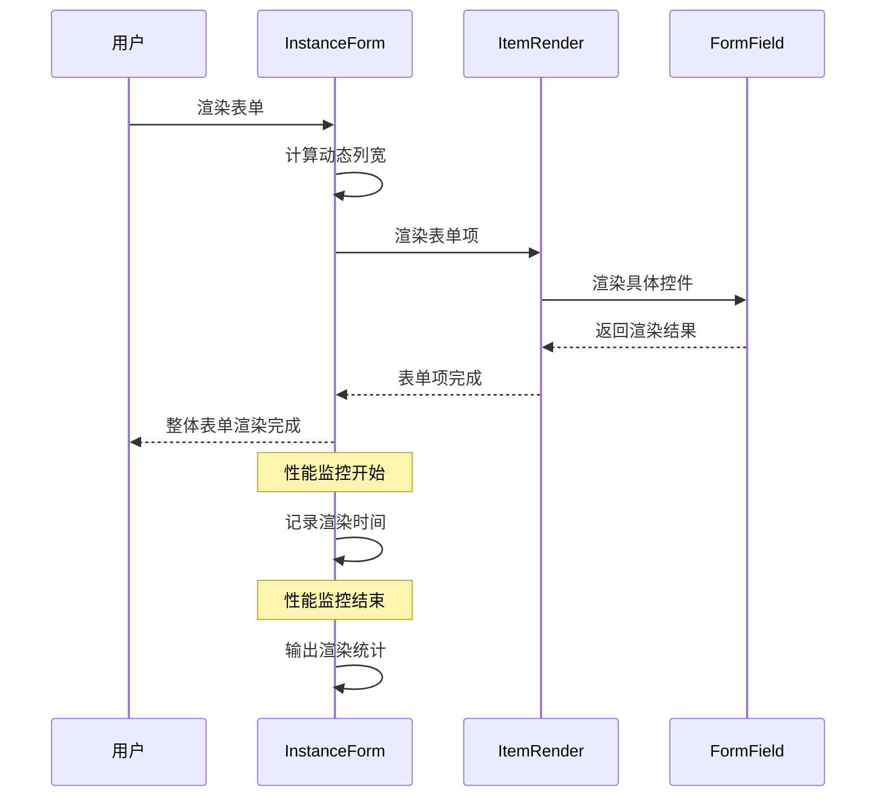
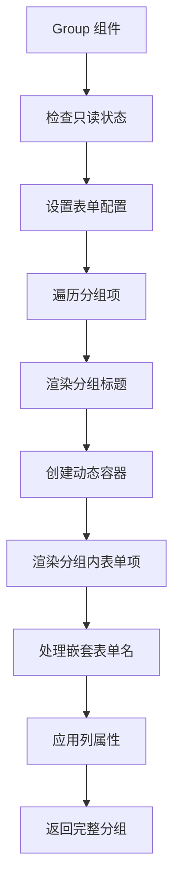
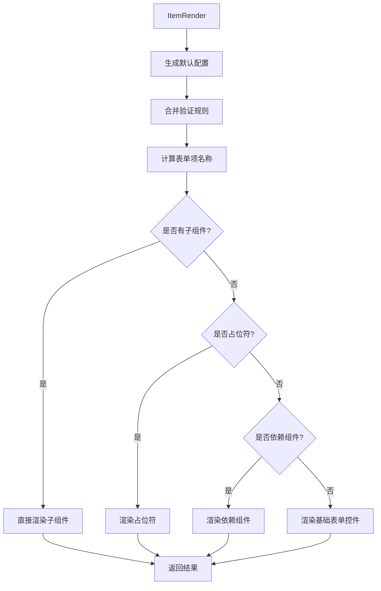
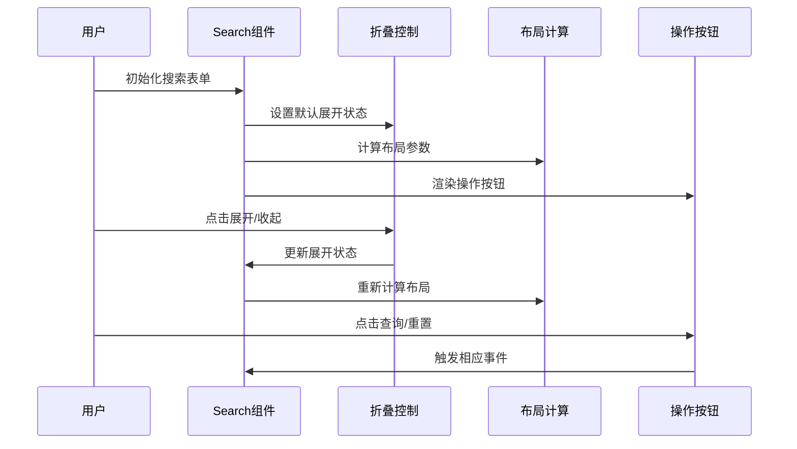
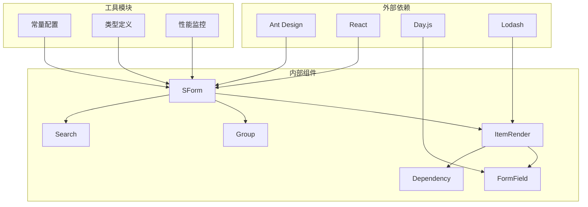
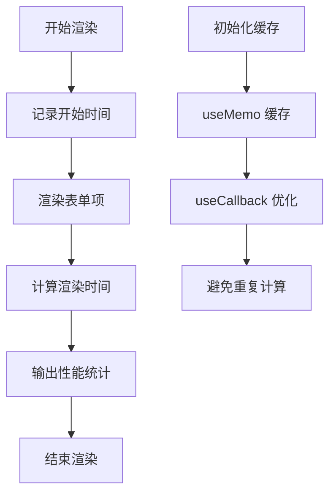

# 表单组件演示集合

<cite>
**本文档引用的文件**
- [package.json](file://package.json)
- [README.md](file://README.md)
- [src/index.ts](file://src/index.ts)
- [src/components/form/index.tsx](file://src/components/form/index.tsx)
- [src/components/form/types.ts](file://src/components/form/types.ts)
- [src/components/form/instance.tsx](file://src/components/form/instance.tsx)
- [src/components/form/constants.tsx](file://src/components/form/constants.tsx)
- [src/components/form/components/group/index.tsx](file://src/components/form/components/group/index.tsx)
- [src/components/form/components/item-render/index.tsx](file://src/components/form/components/item-render/index.tsx)
- [src/components/form/components/search/index.tsx](file://src/components/form/components/search/index.tsx)
- [src/components/form/demos/form.tsx](file://src/components/form/demos/form.tsx)
- [src/components/form/demos/full-example.tsx](file://src/components/form/demos/full-example.tsx)
- [src/components/form/demos/validation.tsx](file://src/components/form/demos/validation.tsx)
- [src/components/form/demos/search.tsx](file://src/components/form/demos/search.tsx)
- [src/components/form/demos/group.tsx](file://src/components/form/demos/group.tsx)
</cite>

## 目录

1. [简介](#简介)
2. [项目结构](#项目结构)
3. [核心组件](#核心组件)
4. [架构概览](#架构概览)
5. [详细组件分析](#详细组件分析)
6. [依赖关系分析](#依赖关系分析)
7. [性能考虑](#性能考虑)
8. [故障排除指南](#故障排除指南)
9. [结论](#结论)

## 简介

@Dalydb/sdesign 是一个基于 Ant Design 二次封装的企业级 React 组件库，专注于提升管理后台开发效率。该项目提供了丰富的表单组件演示集合，涵盖了从基础表单到复杂业务场景的各种使用方式。

该组件库具有以下特性：

- 🎨 **丰富组件** - 50+ 企业级组件，覆盖常见业务场景
- ⚡ **开箱即用** - 基于 Ant Design 5.x，无缝集成
- 🛠️ **强大工具** - 完善的 Hooks 和工具函数库
- 📦 **按需加载** - 支持 tree-shaking，减少打包体积
- 🌍 **TypeScript** - 完整的类型定义支持
- 🎯 **易于定制** - 灵活的主题配置和样式扩展

## 项目结构

项目采用模块化组织结构，核心表单组件位于 `src/components/form/` 目录下，包含完整的类型定义、组件实现和演示示例。

**图表来源**

- [src/components/form/index.tsx](file://src/components/form/index.tsx#L1-L34)
- [src/components/form/types.ts](file://src/components/form/types.ts#L1-L153)
- [src/components/form/instance.tsx](file://src/components/form/instance.tsx#L1-L133)

**章节来源**

- [package.json](file://package.json#L1-L121)
- [README.md](file://README.md#L1-L242)
- [src/index.ts](file://src/index.ts#L1-L5)

## 核心组件

### SForm 主组件

SForm 是整个表单系统的核心组件，基于 Ant Design 的 Form 组件进行了深度封装，提供了更加便捷的使用体验。

主要功能特性：

- **类型安全** - 完整的 TypeScript 类型定义
- **灵活布局** - 支持响应式网格布局
- **内置校验** - 集成预设的验证规则
- **性能优化** - 内置性能监控和优化策略

### 组件映射系统

表单组件库维护了一个完整的组件映射系统，支持多种表单控件类型：

**图表来源**

- [src/components/form/types.ts](file://src/components/form/types.ts#L34-L58)
- [src/components/form/index.tsx](file://src/components/form/index.tsx#L9-L31)

**章节来源**

- [src/components/form/index.tsx](file://src/components/form/index.tsx#L1-L34)
- [src/components/form/types.ts](file://src/components/form/types.ts#L1-L153)

## 架构概览

表单组件系统采用了分层架构设计，从底层的组件映射到上层的业务组件，形成了清晰的层次结构。

**图表来源**

- [src/components/form/instance.tsx](file://src/components/form/instance.tsx#L1-L133)
- [src/components/form/components/group/index.tsx](file://src/components/form/components/group/index.tsx#L1-L135)
- [src/components/form/components/search/index.tsx](file://src/components/form/components/search/index.tsx#L1-L147)
- [src/components/form/constants.tsx](file://src/components/form/constants.tsx#L1-L73)

## 详细组件分析

### 实例表单组件 (InstanceForm)

实例表单组件是 SForm 的核心实现，负责处理表单的基本渲染逻辑和性能优化。

#### 核心特性

1. **性能监控** - 内置渲染性能监控，记录表单项渲染耗时
2. **响应式布局** - 支持动态列数计算和响应式布局
3. **只读模式** - 提供统一的只读状态管理
4. **事件优化** - 使用 useCallback 优化事件处理器

**图表来源**

- [src/components/form/instance.tsx](file://src/components/form/instance.tsx#L16-L34)
- [src/components/form/instance.tsx](file://src/components/form/instance.tsx#L97-L101)

#### 关键实现细节

- **动态列宽计算**：通过 `24/columns` 计算每个表单项的宽度占比
- **性能监控 Hook**：使用 `useRef` 和 `useEffect` 实现精确的渲染时间测量
- **事件处理器优化**：使用 `useCallback` 防止不必要的重新渲染

**章节来源**

- [src/components/form/instance.tsx](file://src/components/form/instance.tsx#L1-L133)

### 分组表单组件 (Group)

分组表单组件提供了表单分组展示能力，支持多个独立的表单区域。

#### 主要功能

1. **标题渲染** - 支持字符串和自定义组件两种标题形式
2. **容器定制** - 支持自定义分组容器组件
3. **嵌套表单名** - 处理复杂的嵌套表单命名空间
4. **动态渲染** - 根据配置动态生成表单项

**图表来源**

- [src/components/form/components/group/index.tsx](file://src/components/form/components/group/index.tsx#L24-L135)

**章节来源**

- [src/components/form/components/group/index.tsx](file://src/components/form/components/group/index.tsx#L1-L135)

### 表单项渲染器 (ItemRender)

表单项渲染器是表单系统中最核心的组件，负责将配置转换为实际的表单控件。

#### 渲染流程

1. **配置缓存** - 缓存默认配置以提高性能
2. **规则合并** - 合并默认规则、必填规则和自定义规则
3. **组件选择** - 根据类型选择对应的表单控件
4. **错误边界** - 包装在错误边界中确保稳定性

**图表来源**

- [src/components/form/components/item-render/index.tsx](file://src/components/form/components/item-render/index.tsx#L16-L124)

**章节来源**

- [src/components/form/components/item-render/index.tsx](file://src/components/form/components/item-render/index.tsx#L1-L124)

### 搜索表单组件 (Search)

搜索表单组件专门用于构建搜索界面，提供了折叠展开、布局优化等功能。

#### 核心特性

1. **折叠控制** - 支持展开/收起搜索条件
2. **布局优化** - 自动计算按钮位置和间距
3. **卡片容器** - 支持卡片样式的容器包装
4. **默认操作** - 内置查询和重置按钮

**图表来源**

- [src/components/form/components/search/index.tsx](file://src/components/form/components/search/index.tsx#L17-L147)

**章节来源**

- [src/components/form/components/search/index.tsx](file://src/components/form/components/search/index.tsx#L1-L147)

## 依赖关系分析

表单组件系统具有清晰的依赖关系，各组件之间通过接口和类型定义进行解耦。

**图表来源**

- [package.json](file://package.json#L52-L98)
- [src/components/form/index.tsx](file://src/components/form/index.tsx#L1-L6)
- [src/components/form/constants.tsx](file://src/components/form/constants.tsx#L1-L27)

### 依赖特点

1. **轻量级依赖** - 仅依赖必要的第三方库
2. **类型安全** - 完整的 TypeScript 类型支持
3. **模块化设计** - 支持按需加载和 tree-shaking
4. **向后兼容** - 保持与 Ant Design 的兼容性

**章节来源**

- [package.json](file://package.json#L52-L101)

## 性能考虑

表单组件系统在设计时充分考虑了性能优化，采用了多种策略来提升用户体验。

### 性能优化策略

1. **渲染性能监控**

   - 使用 `performance.now()` 精确测量渲染时间
   - 记录表单项数量和渲染耗时
   - 输出性能统计信息到控制台

2. **内存优化**

   - 使用 `useMemo` 缓存计算结果
   - 使用 `useCallback` 优化事件处理器
   - 避免不必要的重新渲染

3. **组件懒加载**
   - 重型组件标记为延迟加载
   - 支持按需导入减少初始包体积

### 性能监控实现

**图表来源**

- [src/components/form/instance.tsx](file://src/components/form/instance.tsx#L16-L34)

## 故障排除指南

### 常见问题及解决方案

#### 1. 表单验证问题

**问题描述**：表单验证规则不生效或验证结果不符合预期

**解决方案**：

- 检查 `regKey` 配置是否正确
- 确认 `required` 属性设置
- 验证自定义规则的格式

#### 2. 布局显示异常

**问题描述**：表单项布局错乱或显示不完整

**解决方案**：

- 检查 `columns` 属性设置
- 验证 `colProps` 配置
- 确认响应式断点设置

#### 3. 性能问题

**问题描述**：大表单渲染缓慢或内存占用过高

**解决方案**：

- 使用 `useMemo` 缓存计算结果
- 优化事件处理器使用 `useCallback`
- 考虑分页或虚拟滚动

**章节来源**

- [src/components/form/components/item-render/index.tsx](file://src/components/form/components/item-render/index.tsx#L33-L45)
- [src/components/form/instance.tsx](file://src/components/form/instance.tsx#L67-L95)

## 结论

@Dalydb/sdesign 表单组件演示集合展现了现代 React 组件库的设计理念和最佳实践。通过深入的架构设计、完善的类型系统和全面的性能优化，该组件库为开发者提供了强大而易用的表单解决方案。

### 主要优势

1. **完整的生态系统** - 从基础组件到高级功能的完整覆盖
2. **优秀的开发体验** - TypeScript 支持和直观的 API 设计
3. **高性能表现** - 多层次的性能优化策略
4. **灵活的扩展性** - 支持自定义组件和样式定制

### 应用场景

该组件库特别适用于以下场景：

- 管理后台系统的快速开发
- 复杂业务表单的构建
- 数据录入和查询界面
- 企业级应用的表单需求

通过合理使用这些表单组件，开发者可以显著提升开发效率，同时确保应用的质量和性能。
