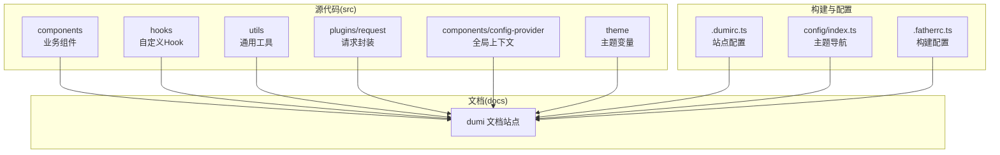
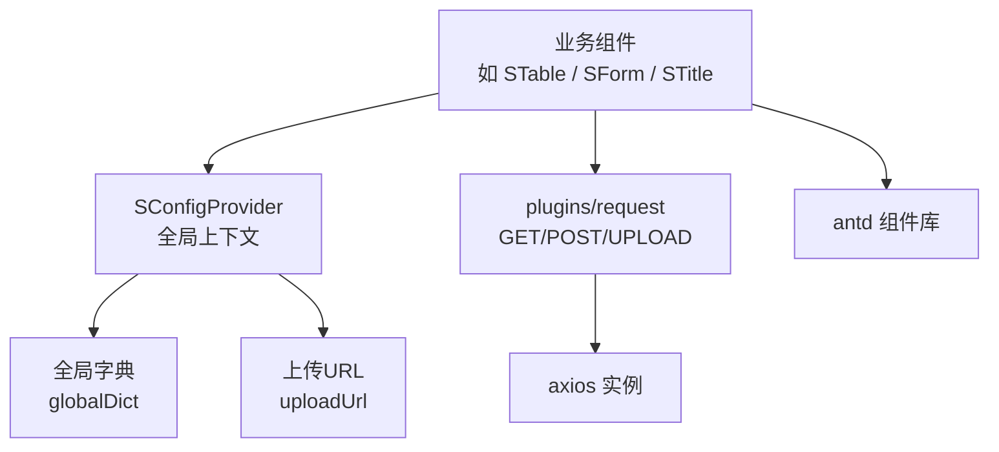
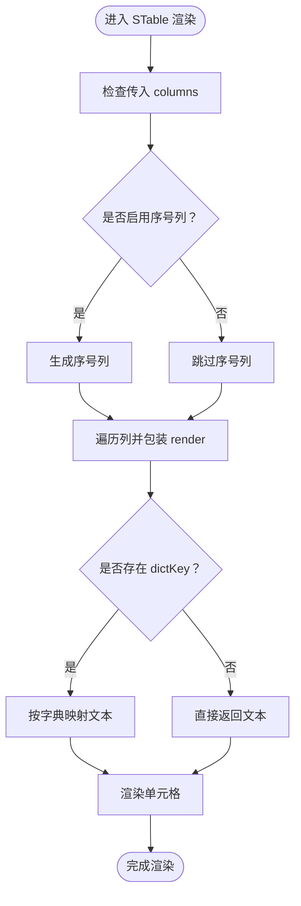
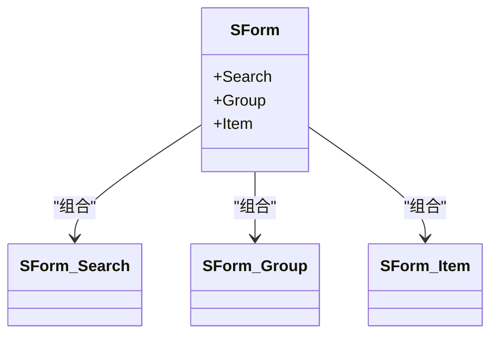
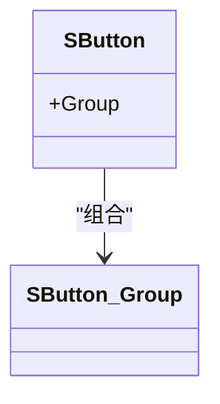
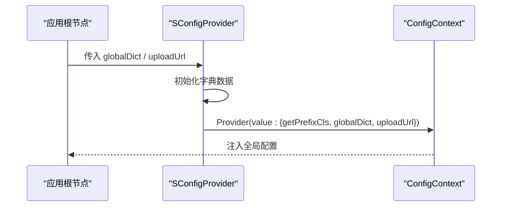
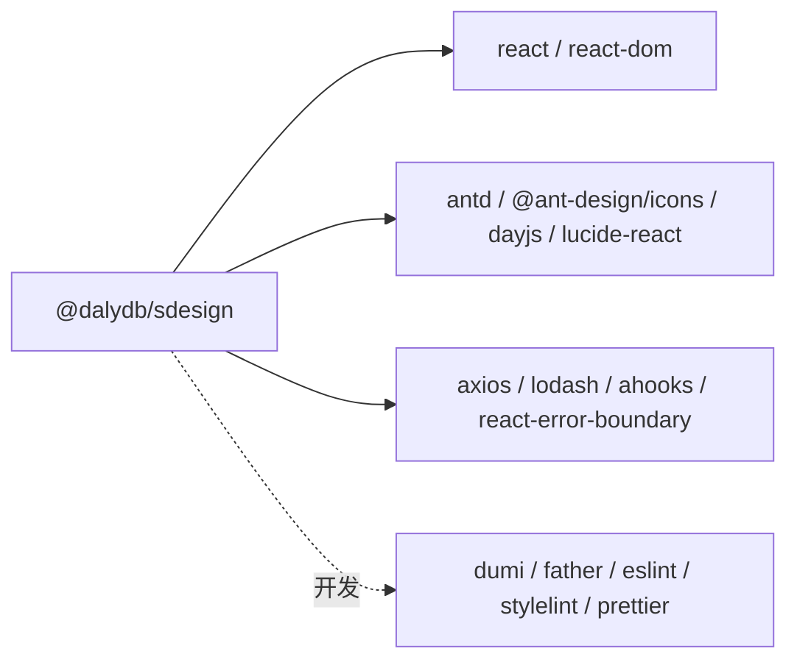

# 项目概述

<cite>
**本文引用的文件**
- [package.json](file://package.json)
- [README.md](file://README.md)
- [src/index.ts](file://src/index.ts)
- [.dumirc.ts](file://.dumirc.ts)
- [config/index.ts](file://config/index.ts)
- [src/components/index.ts](file://src/components/index.ts)
- [src/hooks/index.ts](file://src/hooks/index.ts)
- [src/utils/index.ts](file://src/utils/index.ts)
- [src/components/button/index.tsx](file://src/components/button/index.tsx)
- [src/components/form/index.tsx](file://src/components/form/index.tsx)
- [src/components/table/index.tsx](file://src/components/table/index.tsx)
- [src/components/config-provider/index.tsx](file://src/components/config-provider/index.tsx)
- [src/theme/default.less](file://src/theme/default.less)
- [src/plugins/request/index.ts](file://src/plugins/request/index.ts)
- [docs/introduce-cn/index.md](file://docs/introduce-cn/index.md)
- [docs/version/index.md](file://docs/version/index.md)
- [.fatherrc.ts](file://.fatherrc.ts)
</cite>

## 目录

1. [引言](#引言)
2. [项目结构](#项目结构)
3. [核心组件](#核心组件)
4. [架构总览](#架构总览)
5. [详细组件分析](#详细组件分析)
6. [依赖分析](#依赖分析)
7. [性能考虑](#性能考虑)
8. [故障排查指南](#故障排查指南)
9. [结论](#结论)
10. [附录](#附录)

## 引言

SDesign 是一个面向企业级前端的 PC 端组件库，基于 Ant Design（antd）进行业务层面的二次封装，专注于提升管理类页面的组件复用效率与开发一致性。其核心理念是“以 antd 为基础，结合业务场景做薄封装”，在不改变开发者使用习惯的前提下，提供更贴近实际工程需求的组件与工具。

- 设计理念

  - 以 antd 为 UI 基座，统一设计语言与交互规范
  - 通过 ConfigProvider 提供全局上下文（如全局字典、上传地址等），降低跨页面配置成本
  - 以“组合优先”的方式暴露子组件与 Hook，便于按需引入与二次扩展
  - 采用 CSS-in-JS（antd-style）方案，配合 less 变量体系，实现主题与样式的灵活控制

- 在企业级前端开发中的定位与价值

  - 适用于后台管理系统、数据看板、运营平台等以表格、表单、查询为核心诉求的场景
  - 通过统一的请求插件、字典映射、上传能力与错误边界等基础设施，加速项目初始化与迭代
  - 与 Ant Design 的关系：SDesign 不替代 antd，而是对其组件进行业务增强与组合，形成“业务组件层”

- 差异化优势

  - 面向管理页面的“即用型”封装：如 STable 的列渲染增强、STitle 的标题与操作区组合、SForm 的搜索/分组/项渲染等
  - 全局字典映射与上传 URL 管理：通过 ConfigProvider 统一注入，减少重复配置
  - 与 dumi + father 构建链路集成，提供开箱即用的文档与发布流程

- 适用场景

  - 后台管理系统的通用页面（列表、详情、表单）
  - 需要统一字典映射、上传处理、错误兜底的业务模块
  - 对组件风格一致性和开发效率有较高要求的团队

- 技术栈与版本

  - React 18、TypeScript、Antd 5.x、Dumi、Father、antd-style、Axios、ahooks、dayjs、lodash 等
  - Node >= 16.14，浏览器兼容 React 18+

- 许可证与发布
  - MIT 许可证，支持公开发布与商用
  - 发布到 npm，包名为 @dalydb/sdesign

**章节来源**

- [package.json](file://package.json#L1-L121)
- [README.md](file://README.md#L1-L62)
- [docs/introduce-cn/index.md](file://docs/introduce-cn/index.md#L1-L27)

## 项目结构

仓库采用“模块化 + 层次化”的组织方式：

- src/components：按功能域拆分的业务组件，每个组件包含源码、类型定义、演示与文档
- src/hooks：与组件配套的自定义 Hook，如 useSTable、useSearchTable、useSearchLayout 等
- src/utils：通用工具函数与类型定义
- src/plugins/request：基于 axios 的请求封装，提供 GET/POST/FORM/UPLOAD 等方法与拦截器
- src/components/config-provider：全局上下文提供者，承载字典、上传地址等全局配置
- src/theme：less 变量与默认主题前缀
- docs：组件文档与示例，由 dumi 驱动生成
- 配置文件：.dumirc.ts、.fatherrc.ts、config/index.ts 等，分别负责站点、构建与主题导航

**图表来源**

- [src/index.ts](file://src/index.ts#L1-L5)
- [.dumirc.ts](file://.dumirc.ts#L1-L22)
- [config/index.ts](file://config/index.ts#L1-L27)
- [.fatherrc.ts](file://.fatherrc.ts#L1-L13)

**章节来源**

- [src/index.ts](file://src/index.ts#L1-L5)
- [src/components/index.ts](file://src/components/index.ts#L1-L81)
- [src/hooks/index.ts](file://src/hooks/index.ts#L1-L28)
- [src/utils/index.ts](file://src/utils/index.ts#L1-L10)
- [.dumirc.ts](file://.dumirc.ts#L1-L22)
- [config/index.ts](file://config/index.ts#L1-L27)
- [.fatherrc.ts](file://.fatherrc.ts#L1-L13)

## 核心组件

- 组件导出入口
  - 通过 src/index.ts 统一导出 components、hooks、icons、utils，便于按需引入与 Tree Shaking
- 组件清单（节选）
  - 表单与布局：SForm、SSearchTable、SConfigProvider
  - 数据展示：STable、SDetail、STitle
  - 输入与选择：SInput、SSelect、SCascader、SDatePicker、SDatePickerRange
  - 文件与上传：SFile、SUpload
  - 交互与反馈：SButton、SConfirm、SErrorBoundary、SErrorCom
  - 视觉与辅助：STextEllipsis、SLucideIcon、SCard、SNoData、SNoPage
- 组件命名与组合
  - 多数组件采用“实例 + 子组件”的模式（如 SForm.Search、SForm.Group、SButton.Group），便于按需组合与扩展

**章节来源**

- [src/index.ts](file://src/index.ts#L1-L5)
- [src/components/index.ts](file://src/components/index.ts#L1-L81)
- [src/components/button/index.tsx](file://src/components/button/index.tsx#L1-L15)
- [src/components/form/index.tsx](file://src/components/form/index.tsx#L1-L21)

## 架构总览

SDesign 的运行时架构围绕“组件 + 上下文 + 工具 + 请求”展开：

- 组件层：基于 antd 的二次封装，提供业务常用能力
- 上下文层：SConfigProvider 提供全局字典、上传地址、前缀等配置
- 工具层：utils 提供数据处理、正则、样式等工具；hooks 提供业务逻辑抽象
- 请求层：plugins/request 基于 axios，提供统一的 GET/POST/UPLOAD 方法与拦截器

**图表来源**

- [src/components/table/index.tsx](file://src/components/table/index.tsx#L1-L135)
- [src/components/config-provider/index.tsx](file://src/components/config-provider/index.tsx#L1-L47)
- [src/plugins/request/index.ts](file://src/plugins/request/index.ts#L1-L33)

**章节来源**

- [src/components/table/index.tsx](file://src/components/table/index.tsx#L1-L135)
- [src/components/config-provider/index.tsx](file://src/components/config-provider/index.tsx#L1-L47)
- [src/plugins/request/index.ts](file://src/plugins/request/index.ts#L1-L33)

## 详细组件分析

### STable（表格增强）

- 能力概览
  - 自动序号列、默认小尺寸、列渲染增强（日期格式化、单行省略、字典映射）
  - 与 ConfigProvider 的全局字典联动，支持列级 dictKey 映射
- 关键流程
  - 接收 columns，根据 render 类型自动包装渲染函数
  - 若存在分页参数，则计算序号列的起始值
  - 通过 ConfigContext 获取全局字典，按列 dictKey 进行文本映射

**图表来源**

- [src/components/table/index.tsx](file://src/components/table/index.tsx#L25-L132)

**章节来源**

- [src/components/table/index.tsx](file://src/components/table/index.tsx#L1-L135)

### SForm（表单组合）

- 能力概览
  - 提供 Search、Group、Item 子组件，支持搜索表单、分组容器与表单项渲染
  - 通过实例类型合并子组件，形成“SForm.Search / SForm.Group / SForm.Item”的调用方式
- 设计要点
  - 保持与 antd Form 的一致 API，同时提供业务常用的组合能力

**图表来源**

- [src/components/form/index.tsx](file://src/components/form/index.tsx#L1-L21)

**章节来源**

- [src/components/form/index.tsx](file://src/components/form/index.tsx#L1-L21)

### SButton（按钮组合）

- 能力概览
  - 通过实例类型合并 Group 子组件，形成“SButton.Group”的组合形态
- 设计要点
  - 保持与 antd Button 的一致 API，同时提供按钮组的便捷用法

**图表来源**

- [src/components/button/index.tsx](file://src/components/button/index.tsx#L1-L15)

**章节来源**

- [src/components/button/index.tsx](file://src/components/button/index.tsx#L1-L15)

### SConfigProvider（全局上下文）

- 能力概览
  - 提供 getPrefixCls、globalDict、uploadUrl 等全局配置
  - 通过 Context 将配置注入到子组件树
- 关键流程
  - 初始化字典数据，支持静态字典或动态获取
  - 将配置对象注入到 Context，供下游组件消费

**图表来源**

- [src/components/config-provider/index.tsx](file://src/components/config-provider/index.tsx#L1-L47)

**章节来源**

- [src/components/config-provider/index.tsx](file://src/components/config-provider/index.tsx#L1-L47)

### 主题与样式

- 主题前缀
  - 通过 src/theme/default.less 设置 CSS 变量前缀，避免样式冲突
- 样式方案
  - 采用 antd-style 作为 CSS-in-JS 方案，结合 less 变量实现主题定制

**章节来源**

- [src/theme/default.less](file://src/theme/default.less#L1-L2)

## 依赖分析

- 运行时依赖
  - react、react-dom、antd、dayjs、lodash、axios、ahooks、react-error-boundary、classnames、copy-to-clipboard、antd-style
- 开发依赖
  - dumi、father、@umijs/lint、eslint、stylelint、prettier、husky、jsdom、@types/\* 等
- peerDependencies
  - 与 antd、@ant-design/icons、dayjs、lucide-react、react-router 等保持对齐

**图表来源**

- [package.json](file://package.json#L52-L101)

**章节来源**

- [package.json](file://package.json#L1-L121)

## 性能考虑

- 构建与打包
  - 使用 father 构建 ESM 输出，输出目录 dist，忽略 tests 目录，有利于 Tree Shaking 与按需加载
- 组件渲染
  - STable 对列渲染进行 memo 化处理，减少不必要的重渲染
- 样式与主题
  - 通过 antd-style 与 less 变量，避免全局污染，提升主题切换与样式复用效率

**章节来源**

- [.fatherrc.ts](file://.fatherrc.ts#L1-L13)
- [src/components/table/index.tsx](file://src/components/table/index.tsx#L124-L135)

## 故障排查指南

- 文档与站点
  - 使用 dumi dev/dumi build 启动/构建文档站点，确保 .dumirc.ts 的 alias 与 atomDirs 配置正确
- 构建问题
  - 使用 father build / father dev 进行构建与开发，必要时执行 father doctor 检查依赖与配置
- 请求与鉴权
  - 通过 plugins/request 的 getToken 方法自动注入 Authorization 头；若出现 token 失效，使用 tokenFailure 进行提示与日志输出
- 上下文与字典
  - 确保在应用根部包裹 SConfigProvider，并正确传入 globalDict 与 uploadUrl

**章节来源**

- [.dumirc.ts](file://.dumirc.ts#L1-L22)
- [.fatherrc.ts](file://.fatherrc.ts#L1-L13)
- [src/plugins/request/index.ts](file://src/plugins/request/index.ts#L1-L33)
- [src/components/config-provider/index.tsx](file://src/components/config-provider/index.tsx#L1-L47)

## 结论

SDesign 以“薄封装、强组合、易扩展”为核心，围绕 antd 构建了一套面向管理页面的业务组件体系。通过统一的全局上下文、请求插件与工具集，显著降低了企业级前端在表单、表格、文件上传等常见场景下的开发成本。配合完善的文档与构建链路，SDesign 能够帮助团队快速搭建高质量、高一致性的后台产品。

## 附录

### 快速开始

- 安装
  - 使用 npm 或 pnpm 安装 @dalydb/sdesign
- 基本配置
  - 在应用根部包裹 SConfigProvider，注入 globalDict 与 uploadUrl
- 第一个组件
  - 导入 STitle 并在页面中使用

**章节来源**

- [docs/introduce-cn/index.md](file://docs/introduce-cn/index.md#L15-L27)

### 版本信息与更新记录

- 最新版本：1.1.5
- 更新记录包含新特性、优化、修复与文档更新等内容

**章节来源**

- [docs/version/index.md](file://docs/version/index.md#L1-L96)

### 许可证

- MIT 许可证，允许自由使用、复制、修改与再发布

**章节来源**

- [package.json](file://package.json#L14-L14)
- [README.md](file://README.md#L42-L44)

### 贡献指南

- 开发流程
  - 安装依赖后，使用 npm run dev 启动文档站点
  - 使用 npm run build 构建产物，使用 npm run docs:build 生成静态文档
  - 使用 npm run doctor 进行健康检查
- 代码规范
  - ESLint、Stylelint、Prettier、Biome 等工具保障代码质量
- 重复代码检查
  - 可使用 jscpd 进行重复代码扫描

**章节来源**

- [README.md](file://README.md#L13-L33)
- [package.json](file://package.json#L26-L46)
