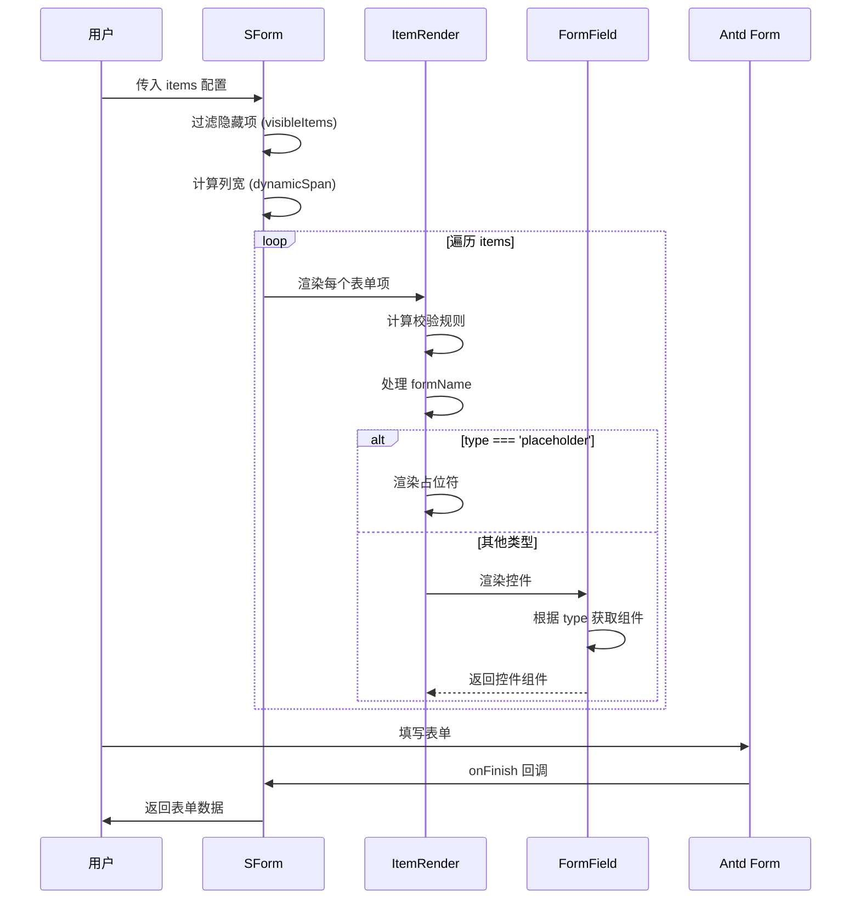

# SForm 表单组件技术文档

SForm 是基于 Ant Design Form 组件的增强封装，提供了配置化表单生成、分组表单、搜索表单等多种模式，支持多种表单控件类型、字段联动、校验规则预置等功能，大幅简化表单开发工作。

## 1. 组件概述

### 目的/职责

- **OVR-001**: 提供配置化表单解决方案，通过 `items` 配置数组自动生成表单项，减少重复代码
- **OVR-002**: 支持三种表单模式：基础表单 (SForm)、分组表单 (SForm.Group)、搜索表单 (SForm.Search)
- **OVR-003**: 封装 18+ 种表单控件类型，统一管理组件映射和默认配置
- **OVR-004**: 提供字段联动、预置校验、只读模式、嵌套数据结构等高级功能

### 核心特性

| 特性       | 描述                                     |
| ---------- | ---------------------------------------- |
| 配置化生成 | 通过 items 数组配置自动生成表单项        |
| 多列布局   | 支持 columns 指定列数，自动计算栅格      |
| 预置校验   | 内置常用正则校验规则 (邮箱、手机号等)    |
| 只读模式   | 一键切换表单只读/编辑模式                |
| 嵌套数据   | 支持 formName 生成嵌套数据结构           |
| 性能优化   | 使用 memo、useMemo、useCallback 优化渲染 |

## 2. 架构设计

### 设计模式

- **ARC-001**: **组合模式 (Composite Pattern)** - SForm 作为容器组件，可组合 Search、Group、Item 等子组件
- **ARC-002**: **工厂模式 (Factory Pattern)** - FormField 根据 type 动态创建对应的表单控件
- **ARC-003**: **策略模式 (Strategy Pattern)** - 不同的表单类型使用不同的渲染策略
- **ARC-004**: **代理模式 (Proxy Pattern)** - ItemRender 作为表单项的代理，统一处理校验、依赖等逻辑

### 依赖关系

| 依赖类型 | 依赖项      | 用途                          |
| -------- | ----------- | ----------------------------- |
| 外部依赖 | antd        | 基础 Form、Grid、各类控件组件 |
| 外部依赖 | react       | React 核心库                  |
| 外部依赖 | lodash      | 工具函数 (isArray, isString)  |
| 内部依赖 | SInput      | 增强的输入框组件              |
| 内部依赖 | SSelect     | 增强的下拉选择组件            |
| 内部依赖 | SDatePicker | 增强的日期选择组件            |
| 内部依赖 | SCard       | 卡片容器组件                  |
| 内部依赖 | STitle      | 标题组件                      |
| 内部依赖 | SCollapse   | 折叠组件                      |

### 组件结构与依赖关系图

```mermaid
graph TB
    subgraph "SForm 组件体系"
        SForm["SForm<br/>(主入口)"]
        InstanceForm["InstanceForm<br/>(基础表单)"]
        Search["SForm.Search<br/>(搜索表单)"]
        Group["SForm.Group<br/>(分组表单)"]
        ItemRender["ItemRender<br/>(表单项渲染)"]
        FormField["FormField<br/>(控件工厂)"]
    end

    subgraph "静态成员"
        FormItem["SForm.FormItem"]
        useForm["SForm.useForm"]
        useWatch["SForm.useWatch"]
        useFormInstance["SForm.useFormInstance"]
        ErrorList["SForm.ErrorList"]
        List["SForm.List"]
    end

    subgraph "表单控件"
        SInput["SInput"]
        SSelect["SSelect"]
        SDatePicker["SDatePicker"]
        SDatePickerRange["SDatePickerRange"]
        SRadioGroup["SRadioGroup"]
        SCheckGroup["SCheckGroup"]
        SCascader["SCascader"]
        OtherControls["...其他控件"]
    end

    subgraph "辅助组件"
        SErrorBoundary["SErrorBoundary"]
        DynamicContainer["DynamicContainer"]
        STitle["STitle"]
        SCollapse["SCollapse"]
    end

    subgraph "外部依赖"
        AntdForm["antd/Form"]
        AntdGrid["antd/Row, Col"]
        AntdControls["antd/控件"]
    end

    SForm --> InstanceForm
    SForm --> Search
    SForm --> Group
    SForm --> ItemRender
    SForm --> FormItem
    SForm --> useForm
    SForm --> useWatch
    SForm --> useFormInstance
    SForm --> ErrorList
    SForm --> List

    InstanceForm --> ItemRender
    Search --> ItemRender
    Group --> ItemRender

    ItemRender --> FormField
    ItemRender --> SErrorBoundary

    FormField --> SInput
    FormField --> SSelect
    FormField --> SDatePicker
    FormField --> SDatePickerRange
    FormField --> SRadioGroup
    FormField --> SCheckGroup
    FormField --> SCascader
    FormField --> OtherControls

    Search --> DynamicContainer
    Search --> SCollapse
    Group --> DynamicContainer
    Group --> STitle

    InstanceForm --> AntdForm
    InstanceForm --> AntdGrid
    FormField --> AntdControls

    classDef primary fill:#1890ff,color:#fff
    classDef secondary fill:#52c41a,color:#fff
    classDef helper fill:#faad14,color:#fff
    classDef external fill:#722ed1,color:#fff

    class SForm,InstanceForm,Search,Group primary
    class ItemRender,FormField secondary
    class SErrorBoundary,DynamicContainer,STitle,SCollapse helper
    class AntdForm,AntdGrid,AntdControls external
```



### 数据流图



## 3. 接口文档

### SForm Props

| 属性         | 类型                    | 默认值 | 必填 | 描述                          |
| ------------ | ----------------------- | ------ | ---- | ----------------------------- |
| items        | `SFormItems[]`          | -      | 否   | 表单配置项数组                |
| columns      | `number`                | 1      | 否   | 表单列数                      |
| rowProps     | `RowProps`              | -      | 否   | Row 组件属性                  |
| readonly     | `boolean`               | false  | 否   | 是否只读模式                  |
| formName     | `string`                | -      | 否   | 嵌套数据结构的前缀            |
| onFinish     | `(values: any) => void` | -      | 否   | 表单提交回调                  |
| onReset      | `(e: any) => void`      | -      | 否   | 表单重置回调                  |
| ...formProps | `FormProps`             | -      | 否   | 继承 Ant Design Form 所有属性 |

### SFormItems 配置项

| 属性       | 类型                | 默认值  | 必填 | 描述                          |
| ---------- | ------------------- | ------- | ---- | ----------------------------- |
| type       | `FormItemType`      | 'input' | 否   | 组件类型                      |
| label      | `ReactNode`         | -       | 否   | 标签文本                      |
| name       | `NamePath`          | -       | 否   | 字段名                        |
| fieldProps | `object`            | -       | 否   | 传递给控件的属性              |
| required   | `boolean \| string` | -       | 否   | 是否必填，string 时为错误提示 |
| regKey     | `RegKeyType`        | -       | 否   | 预置校验规则 key              |
| hidden     | `boolean`           | false   | 否   | 是否隐藏                      |
| disabled   | `boolean`           | false   | 否   | 是否禁用                      |
| readonly   | `boolean`           | false   | 否   | 是否只读                      |
| colProps   | `ColProps`          | -       | 否   | Col 组件属性                  |
| render     | `RenderChildren`    | -       | 否   | 自定义渲染函数                |
| customCom  | `ReactNode`         | -       | 否   | 自定义组件                    |
| formName   | `string`            | -       | 否   | 嵌套数据结构前缀              |

### SForm.Search Props

| 属性          | 类型                        | 默认值 | 必填 | 描述             |
| ------------- | --------------------------- | ------ | ---- | ---------------- |
| showExpand    | `boolean`                   | true   | 否   | 是否显示展开收起 |
| defaultExpand | `boolean`                   | true   | 否   | 默认是否展开     |
| onExpand      | `(expand: boolean) => void` | -      | 否   | 展开收起回调     |
| isCard        | `boolean`                   | true   | 否   | 是否显示卡片背景 |
| container     | `React.ComponentType`       | -      | 否   | 自定义容器组件   |
| actionNode    | `ReactNode`                 | -      | 否   | 自定义操作按钮   |

### SForm.Group Props

| 属性       | 类型                  | 默认值 | 必填 | 描述             |
| ---------- | --------------------- | ------ | ---- | ---------------- |
| groupItems | `GroupItemsType[]`    | -      | 否   | 分组配置项       |
| container  | `React.ComponentType` | SCard  | 否   | 外部容器组件     |
| readonly   | `boolean`             | false  | 否   | 是否只读模式     |
| formName   | `string`              | -      | 否   | 嵌套数据结构前缀 |

### GroupItemsType

| 属性      | 类型                  | 默认值 | 描述         |
| --------- | --------------------- | ------ | ------------ |
| title     | `ReactNode`           | -      | 分组标题     |
| columns   | `number`              | 1      | 列数         |
| items     | `SFormItems[]`        | -      | 表单项配置   |
| container | `React.ComponentType` | -      | 自定义容器   |
| rowProps  | `RowProps`            | -      | Row 属性     |
| formName  | `string`              | -      | 嵌套数据前缀 |

### 支持的表单控件类型

| type             | 对应组件               | 说明                           |
| ---------------- | ---------------------- | ------------------------------ |
| input            | SInput                 | 输入框                         |
| inputNumber      | InputNumber            | 数字输入框                     |
| password         | Input.Password         | 密码输入框                     |
| textarea         | Input.TextArea         | 文本域                         |
| select           | SSelect                | 下拉选择                       |
| radioGroup       | SRadioGroup            | 单选组                         |
| checkGroup       | SCheckGroup            | 多选组                         |
| switch           | Switch                 | 开关                           |
| slider           | Slider                 | 滑块                           |
| datePicker       | SDatePicker            | 增强日期选择                   |
| SDatePicker      | SDatePicker            | 已废弃，请使用 datePicker      |
| datePickerRange  | SDatePickerRange       | 增强日期范围选择               |
| SDatePickerRange | SDatePickerRange       | 已废弃，请使用 datePickerRange |
| timePicker       | TimePicker             | 时间选择                       |
| timePickerRange  | TimePicker.RangePicker | 时间范围选择                   |
| cascader         | SCascader              | 增强级联选择                   |
| SCascader        | SCascader              | 已废弃，请使用 cascader        |
| treeSelect       | TreeSelect             | 树选择                         |
| checkbox         | Checkbox               | 复选框                         |
| table            | Table                  | 表格                           |
| placeholder      | -                      | 占位符                         |

### 静态方法和组件

| 名称                  | 类型 | 描述            |
| --------------------- | ---- | --------------- |
| SForm.useForm         | Hook | 创建表单实例    |
| SForm.useWatch        | Hook | 监听字段值变化  |
| SForm.useFormInstance | Hook | 获取表单实例    |
| SForm.FormItem        | 组件 | 原生 Form.Item  |
| SForm.ErrorList       | 组件 | 错误列表        |
| SForm.List            | 组件 | 动态表单列表    |
| SForm.Item            | 组件 | ItemRender 组件 |
| SForm.Search          | 组件 | 搜索表单        |
| SForm.Group           | 组件 | 分组表单        |

## 4. 实现细节

### 核心组件实现

#### InstanceForm (基础表单)

```typescript
const InstanceForm: FC<SFormProps> = ({
  rowProps,
  columns = 1,
  items,
  onFinish,
  onReset,
  readonly = false,
  children,
  formName,
  layout = 'vertical',
  style,
  ...formProps
}) => {
  // 动态占比计算
  const dynamicSpan = useMemo(() => 24 / columns, [columns]);

  // 过滤隐藏项
  const visibleItems = useMemo(() => {
    return (items ?? []).filter((item) => !item.hidden);
  }, [items]);

  return (
    <Form layout={layout} {...formProps} onFinish={onFinish}>
      <Row gutter={[24, 16]} {...rowProps}>
        {visibleItems.map((item, index) => (
          <Col key={item.name || index} span={dynamicSpan}>
            <ItemRender readonly={readonly} formName={formName} {...item} />
          </Col>
        ))}
      </Row>
      {children}
    </Form>
  );
};
```

#### FormField (控件工厂)

```typescript
function FormField<T extends FormComType>({
  type,
  ...restProps
}: FormFieldProps<T>) {
  // 检查是否为重型组件，使用懒加载
  const isHeavyComponent = HEAVY_COMPONENTS.includes(type as any);

  // 使用 Map 优化查找性能
  const Component = isHeavyComponent
    ? HeavyComponentMap[type]
    : FORM_ITEM_COM_MAP_BY_KEY.get(type ?? 'input');

  // 重型组件使用 Suspense 包裹
  if (isHeavyComponent) {
    return (
      <Suspense fallback={<div>加载中...</div>}>
        <Component {...restProps} />
      </Suspense>
    );
  }

  return <Component {...restProps} />;
}
```

### 性能优化策略

- **IMP-001**: 使用 `memo` 包裹所有子组件，避免不必要的重渲染
- **IMP-002**: 使用 `useMemo` 缓存计算结果 (dynamicSpan, visibleItems, formStyle)
- **IMP-003**: 使用 `useCallback` 缓存事件处理函数 (handleFinish, handleReset)
- **IMP-004**: 重型组件 (cascader, table) 使用 `lazy` + `Suspense` 懒加载
- **IMP-005**: 使用 `Map` 数据结构优化组件查找性能

### 校验规则处理

```typescript
const itemRules = useMemo(() => {
  const defaultRules = restProps?.rules ?? [];
  const curReg = getRegData(regKey as RegKeyType) ?? []; // 预置正则校验
  const requiredRule = genRequiredRule(required) ?? []; // 必填校验

  return [...defaultRules, ...requiredRule, ...curReg];
}, [restProps?.rules, regKey, required]);
```

## 5. 使用示例

### 基础表单

```tsx
import { SForm, SFormItems } from '@dalydb/sdesign';
import { Form, Button } from 'antd';

export default () => {
  const [form] = Form.useForm();

  const items: SFormItems[] = [
    {
      type: 'input',
      label: '用户名',
      name: 'username',
      required: '请输入用户名',
    },
    { type: 'password', label: '密码', name: 'password', required: true },
    {
      type: 'select',
      label: '角色',
      name: 'role',
      fieldProps: { dict: { admin: '管理员', user: '普通用户' } },
    },
  ];

  return (
    <SForm
      form={form}
      items={items}
      columns={2}
      onFinish={(values) => console.log(values)}
    />
  );
};
```

### 搜索表单

```tsx
import { SForm, SFormItems } from '@dalydb/sdesign';

export default () => {
  const items: SFormItems[] = [
    { type: 'input', label: '关键词', name: 'keyword' },
    {
      type: 'select',
      label: '状态',
      name: 'status',
      fieldProps: { dict: { 1: '启用', 0: '禁用' } },
    },
    { type: 'datePickerRange', label: '日期范围', name: 'dateRange' },
  ];

  return (
    <SForm.Search
      items={items}
      columns={4}
      onFinish={(values) => console.log('搜索:', values)}
      onReset={() => console.log('重置')}
    />
  );
};
```

### 分组表单

```tsx
import { SForm, GroupItemsType } from '@dalydb/sdesign';

export default () => {
  const groupItems: GroupItemsType[] = [
    {
      title: '基础信息',
      columns: 2,
      items: [
        { type: 'input', label: '姓名', name: 'name', required: true },
        { type: 'input', label: '电话', name: 'phone' },
      ],
    },
    {
      title: '详细信息',
      items: [{ type: 'textarea', label: '地址', name: 'address' }],
    },
  ];

  return <SForm.Group groupItems={groupItems} onFinish={console.log} />;
};
```

### 只读模式

```tsx
import { SForm, SFormItems } from '@dalydb/sdesign';
import { useState } from 'react';

export default () => {
  const [readonly, setReadonly] = useState(false);

  const items: SFormItems[] = [
    { type: 'input', label: '用户名', name: 'username' },
    { type: 'input', label: '邮箱', name: 'email' },
  ];

  return (
    <>
      <Switch checked={readonly} onChange={setReadonly} />
      <SForm items={items} readonly={readonly} />
    </>
  );
};
```

### 嵌套数据结构

```tsx
import { SForm, SFormItems } from '@dalydb/sdesign';

export default () => {
  const items: SFormItems[] = [
    { type: 'input', label: '公司名称', name: 'companyName' },
    { type: 'input', label: '联系人', name: 'contact' },
  ];

  // 使用 formName 后，表单数据结构为:
  // { company: { companyName: '...', contact: '...' } }
  return <SForm items={items} formName="company" />;
};
```

### 使用 Hook 方法

```tsx
import { SForm } from '@dalydb/sdesign';

export default () => {
  const [form] = SForm.useForm();
  const username = SForm.useWatch('username', form);

  return (
    <SForm form={form}>
      <SForm.FormItem name="username" label="用户名">
        <Input />
      </SForm.FormItem>
      <div>当前用户名: {username}</div>
    </SForm>
  );
};
```

### 动态表单列表

```tsx
import { SForm } from '@dalydb/sdesign';
import { Button, Input } from 'antd';

export default () => {
  return (
    <SForm>
      <SForm.List name="users">
        {(fields, { add, remove }) => (
          <>
            {fields.map((field) => (
              <div key={field.key}>
                <SForm.FormItem
                  {...field}
                  name={[field.name, 'name']}
                  label="姓名"
                >
                  <Input />
                </SForm.FormItem>
                <Button onClick={() => remove(field.name)}>删除</Button>
              </div>
            ))}
            <Button onClick={() => add()}>添加</Button>
          </>
        )}
      </SForm.List>
    </SForm>
  );
};
```

## 6. 质量属性

### 性能 (Performance)

- **QUA-001**: 组件级 memo 优化，避免父组件更新导致的不必要渲染
- **QUA-002**: 重型组件懒加载，减少首屏 bundle 体积
- **QUA-003**: Map 数据结构优化组件查找，O(1) 时间复杂度
- **QUA-004**: 性能监控 Hook 支持，可追踪表单渲染耗时

### 可维护性 (Maintainability)

- **QUA-005**: TypeScript 类型完整，所有 Props 都有类型定义
- **QUA-006**: 组件职责单一，ItemRender 专注表单项渲染，FormField 专注控件创建
- **QUA-007**: 配置与组件分离，FORM_ITEM_COM_MAP 集中管理组件映射

### 可扩展性 (Extensibility)

- **QUA-008**: 支持 customCom 自定义组件
- **QUA-009**: 支持 container 自定义容器
- **QUA-010**: 支持 render 自定义渲染
- **QUA-011**: 可通过修改 FORM_ITEM_COM_MAP 扩展新的表单控件类型

### 可靠性 (Reliability)

- **QUA-012**: SErrorBoundary 错误边界保护，单个表单项报错不影响整体
- **QUA-013**: 类型校验，未知组件类型会显示友好错误提示
- **QUA-014**: 默认值处理，type 默认 'input'，columns 默认 1

## 7. 参考信息

### 文件结构

```
src/components/form/
├── index.tsx          # 入口文件，组合静态成员
├── instance.tsx       # InstanceForm 基础表单组件
├── types.ts           # TypeScript 类型定义
├── constants.tsx      # 组件映射常量
├── OPTIMIZATION.md    # 性能优化说明
├── index.md           # Dumi 文档
├── components/
│   ├── search/        # 搜索表单组件
│   ├── group/         # 分组表单组件
│   ├── item-render/   # 表单项渲染组件
│   └── form-field/    # 表单控件工厂组件
└── demos/             # 示例文件
    ├── form.tsx
    ├── search.tsx
    ├── group.tsx
    ├── form-readonly.tsx
    └── ...
```

### 相关文档

- [Ant Design Form 文档](https://ant-design.antgroup.com/components/form-cn)
- [Ant Design Grid 文档](https://ant-design.antgroup.com/components/grid-cn)
- [组件库快速开始](/README.md)
- [SSelect 组件](/components/select)
- [SDatePicker 组件](/components/date-picker)

### 更新日志

| 版本 | 日期       | 更新内容               |
| ---- | ---------- | ---------------------- |
| 1.0  | 2024-03-02 | 初始版本，完成基础文档 |

### 常见问题

#### Q: 如何自定义表单控件？

使用 `customCom` 属性：

```tsx
{
  type: 'input',
  label: '自定义',
  name: 'custom',
  customCom: <MyCustomComponent />
}
```

#### Q: 如何获取嵌套数据结构？

使用 `formName` 属性：

```tsx
<SForm items={items} formName="user" />
// 表单数据: { user: { name: '...', email: '...' } }
```

#### Q: 表单校验不生效？

1. 检查是否设置了 `name` 属性
2. 检查 `required` 和 `regKey` 配置
3. 确保 `rules` 格式正确
